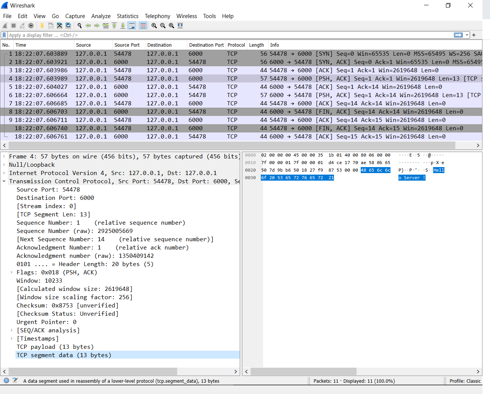

import Link from '@docusaurus/Link';
import site from '@site/course.json'

## Introduction to Wireshark 
[Wireshark](https://www.wireshark.org/docs/wsug_html_chunked/ChapterIntroduction.html) is a open-source 
network protocol analyzer. It is extremely useful in debugging network traffic. Wireshark consists of 
two parts: one is a packet capture engine powered by `tcpdump`, and the other is a powerful and expressive 
packet parsing capability that understands hundreds of different network protocols. [Download](https://www.wireshark.org/#download) and install Wireshark.

## TCP Packets Analysis in Wireshark

Let's examine packets captured during [TCP communication](https://www.guru99.com/tcp-3-way-handshake.html) from <Link to={frontMatter.tcp_capture}>this</Link> pcap file. 



Here both server as well as client are running on localhost (i.e., `127.0.0.1`). Server is using port `6000` 
and Client is using port 54478. After three way handshake, Client sends data to Server(Packet no. 4). 
Server acknowledges and then replies back to the Client with some data(Packet no. 6). The Client 
acknowledges this packet. Finally socket is closed from both sides.

## Capture the Live Traffic

1. Python is pre-installed on most Linux distributions and MacOS. However, if Python is not installed, you can download and install it from [here](https://www.python.org/downloads/). Use the following python scripts for generating network traffic.

```python
#TCPServer.py
import socket
SERVER_IP = "127.0.0.1"
SERVER_PORT = 6000
sock = socket.socket(socket.AF_INET,socket.SOCK_STREAM)
sock.bind((SERVER_IP, SERVER_PORT))
sock.listen(5)

while(1):
    connection,client_address=sock.accept()
    data = connection.recv(1024)
    print("Received Data from ",client_address ,data)
    connection.sendall(b"Hello Client!")
    connection.close()

sock.close()
```

```python
#TCPClient.py
import socket
SERVER_IP = "127.0.0.1"
SERVER_PORT = 6000
MESSAGE = b"Hello Server!"

sock = socket.socket(socket.AF_INET, # Internet
                     socket.SOCK_STREAM) # TCP
sock.connect((SERVER_IP,SERVER_PORT))

sock.sendall(MESSAGE)
data =sock.recv(1024)
print("Received Data from server: ",data)
sock.close()
```

2.  Default port for TCP Server is set to `6000`. We will be running our TCP Server over local interface 
    with ip address `127.0.0.1`. Start the TCP Server using following command:

```bash
    python TCPServer.py
``` 

3.  In order to capture the packets we must first select the interface(in our case loopback interface)
    on which communication is going on. From Menu bar select Capture->Options->Npcap Loopback Adapter. 
    If interface is already selected then you can start capture directly by clicking on Start button 
    which resembles the Blue colored shark fin.

4.  Execute the TCP Client script using following command:

```bash
    python TCPClient.py
``` 

5.  After successful capture of the packets. Kill the server and stop the capture by clicking on Red 
    colored Stop button next to Start button.

## Additional Packets Analysis

1.  Examine the HTTP transaction from <Link to={frontMatter.http_capture}>this</Link> pcap file. 
    Alternatively try to run the http server using following python script. Use browser as a client. Try 
    to access http://127.0.0.1:7000/ from browser. Capture the packets using technique learnt from the 
    previous excercise.

```python
"""
 Implements a simple HTTP/1.0 Server
 Reference: https://www.codementor.io/@joaojonesventura/building-a-basic-http-server-from-scratch-in-python-1cedkg0842  
 python HTTP_Server.py
"""
import socket
# Define socket host and port
SERVER_HOST = '0.0.0.0'
SERVER_PORT = 7000

# Create socket
server_socket = socket.socket(socket.AF_INET, socket.SOCK_STREAM)
server_socket.setsockopt(socket.SOL_SOCKET, socket.SO_REUSEADDR, 1)
server_socket.bind((SERVER_HOST, SERVER_PORT))
server_socket.listen(1)
print('Listening on port %s ...' % SERVER_PORT)

while True:    
    # Wait for client connections
    client_connection, client_address = server_socket.accept()

    # Get the client request
    request = client_connection.recv(1024).decode()
    print(request)

    # Send HTTP response
    response = 'HTTP/1.0 200 OK\n\nHello World'
    client_connection.sendall(response.encode())
    client_connection.close()

# Close socket
server_socket.close()
```

2.  Now let's examine <Link to={frontMatter.webchat_capture}>this</Link> pcap file containing 
    transactions with webchat server from homework5. <mark>Gradescope Questions will be based on 
    it</mark>. In this scenario, three clients are communicating with each other using webchat server. 
    Initially on connecting with webchat server each client sends message saying, "Hello, I am Client <
    1/2/3>". Later while disconnecting each client sends message saying, "Bye, from Client <1/2/3>" 

## Tips and Tricks

-  While running program on remote system, GUI based Wireshark will not be available directly. Thus it 
    is recommended to use `tshark` or `tcpdump` to capture the packets and store them in pcap file on remote system. 
    This file can be later analyzed with Wireshark. You can install `tshark` on Linux using `sudo apt-get update && sudo apt-get install tshark -y`. Similar to Python `tcpdump` is pre-installed with most Linux distributions and MacOS. <u>Please note that installing programs and capturing traffic require admin privilege which is not available on SystemsX.</u>
    The following commands tell `tshark` and `tcpdump` to capture traffic on a specific interface: 

```bash
    sudo tshark -i <interface name> -w <filename>.pcap
    sudo tcpdump -i <interface name> -w <filename>.pcap
```

-  Filters are valuable features of Wireshark. Simply Right Click on any field within Packet Details 
    Pane and select Apply as Filter. Now only packets satisfying filters will be displayed. For instance, 
    using the following filter will display packets with `tcp` port `1234`, and source and destination IP address
    `1.2.3.3` and `1.2.3.4`.

```bash
    (tcp.dstport == 1234) && (ip.dst == 1.2.3.4) && (ip.src == 1.2.3.3)
```

-  Many times you might face the issue of "Port Already in use" even though program seems terminated. 
    In this case find pid associated with that port using netstat and kill the program using acquired pid.

```bash
    netstat -atp | grep <port no. under use>
    sudo kill -9 <pid>
```

Note: If you are using systemsX machines for these experiments then use the <Link to={frontMatter.student_ports_link}>port</Link> assigned to you from <Link to={frontMatter.github_link}>homework5</Link>. 

Answer the Gradescope Quiz based on your learning.

## Peer evaluation rubric

You can find your pairings for the lab in <Link to={frontMatter.pairings}>this sheet</Link>. Please grade your peers out of **1 point** using <Link to={site.eval_link}>this form</Link>.

| Session | Task | Points |
|---|---|---|
| Session A | Discuss questions 1, 2, and 3 | 1 point |
| Session B | Discuss questions 4 and 5 | 1 point |


## Total grade calculation

| Task | Points |
|---|---|
| Turn in the Gradescope assignment | 6 points |
| Discuss your answers | 1 point |
| Evaluate another student | 1 point |
| Total points | 8 points |
